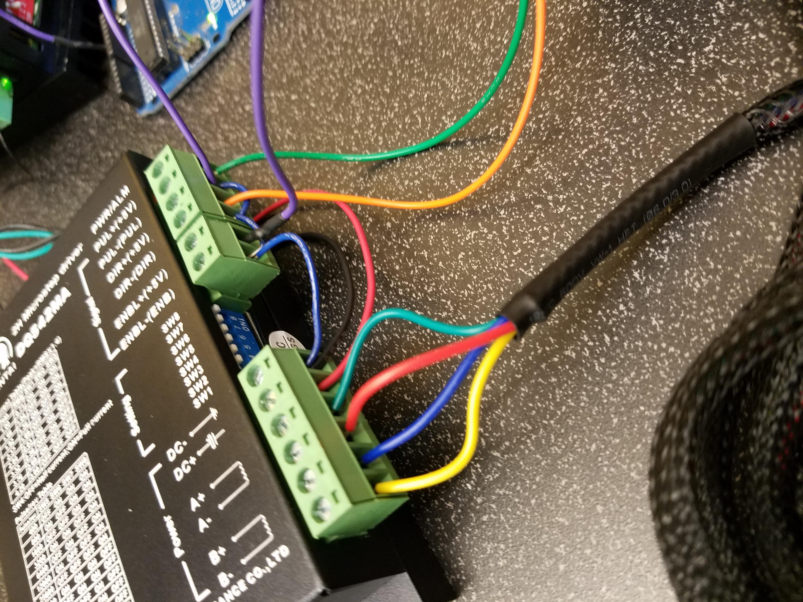

# Arias Research Group - Force, Strain, and Torsion Calibration

[First Demo](https://photos.app.goo.gl/k4PucZ8dLAiMEf3GA)

[TB6600 Stepper Motor Driver](https://www.dfrobot.com/wiki/index.php/TB6600_Stepper_Motor_Driver_SKU:_DRI0043)


[Small Motor](https://www.pololu.com/file/0J714/SY42STH38-1684A.pdf)

[1A...2B Notation vs A+...B- notation](https://groups.google.com/forum/#!topic/ultimaker/zdIKGwMXf28)

https://processing.org/reference/libraries/

[Small Stepper Motor Driver](https://www.pololu.com/category/229/mp6500-stepper-motor-driver-carriers)



Note on processing install: On my Arch Linux install, Processsing wouldn't start with the follow error:
```java
Picked up _JAVA_OPTIONS: -Dawt.useSystemAAFontSettings=gasp
-Djava.ext.dirs=/usr/share/processing/java/lib/ext is not supported.  Use -classpath instead.
Error: Could not create the Java Virtual Machine.
Error: A fatal exception has occurred. Program will exit.
```

This was fixed by going to `/usr/bin` and editting the `_JAVA_OPTIONS` variable and removing the `-Djava.ext.dirs=/usr/share/processing/java/lib/ext` option.

Processing Libraries:

http://lagers.org.uk/g4ptool/index.html

http://www.sojamo.de/libraries/controlP5/
