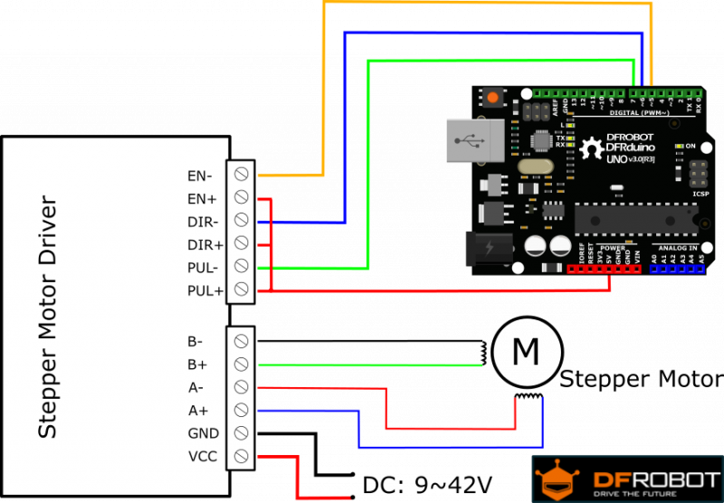

# Arias Research Group - Force, Strain, and Torsion Calibration

[TB6600 Stepper Motor Driver](https://www.dfrobot.com/wiki/index.php/TB6600_Stepper_Motor_Driver_SKU:_DRI0043)

[Small Motor](https://www.pololu.com/file/0J714/SY42STH38-1684A.pdf)

[1A...2B Notation vs A+...B- notation](https://groups.google.com/forum/#!topic/ultimaker/zdIKGwMXf28)
